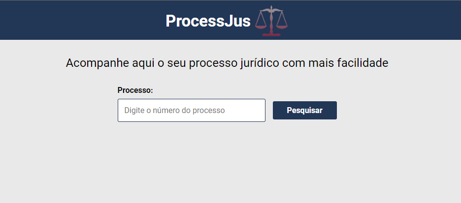
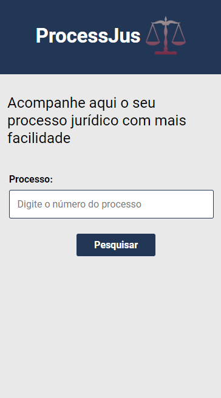

# Digesto | Consulta Processos

## Como usar? ##
 
 <div align="center">
   
 </div>
 <div align="center">
   
 </div>

  &#xa0;


</div>

<p align="center">
  <a href="#dart-sobre">Sobre</a> &#xa0; | &#xa0;   
  <a href="#rocket-tecnologias">Tecnologias</a> &#xa0; | &#xa0;
  <a href="#white_check_mark-pré-requesitos">Pré-requisitos</a> &#xa0; | &#xa0;
  <a href="#checkered_flag-começando">Iniciando</a> &#xa0; | &#xa0;  
</p>

<br>

## :dart: Sobre ##

<p> A aplicação consistem em um site de busca e informações do andamento de processos jurídicos, disponíveis na API da Digesto (https://www.digesto.com.br/), que é uma empresa da Jusbrasil (https://www.jusbrasil.com.br/home).</p>

## :rocket: Tecnologias ##

As seguintes ferramentas foram usadas na construção do projeto:

- [React](https://pt-br.reactjs.org/)
- [Yarn](https://yarnpkg.com/)
- [Vite](https://vitejs.dev/)
- [Cypress](https://www.cypress.io/)

## :white_check_mark: Pré-requisitos ##

Antes de começar :checkered_flag:, você precisa ter o [Git](https://git-scm.com) e o [Node](https://nodejs.org/en/) instalados no PC!

## :checkered_flag: Iniciando ##

```bash
# Clone este repositório
$ git clone https://github.com/gabivechiatto/teste_jusbrasil_front

# Entre na pasta
$ cd teste_jusbrasil_front

# Instale as dependências
$ yarn

# Para iniciar rodar projeto local
$ yarn dev

# Para rodar os testes e2e
$ npx cypress open
```

&#xa0;

<a href="#top">Voltar para o topo</a>
